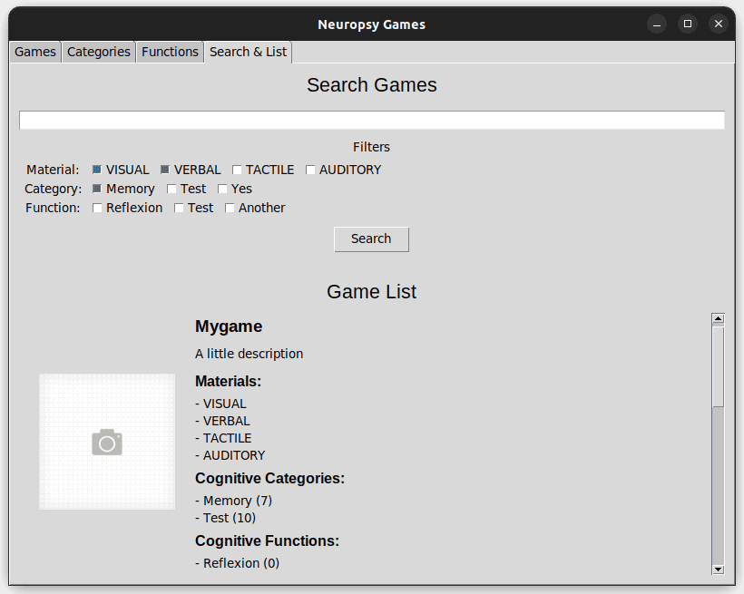

# Games Classification

This tool is used to store board games information with cognitive categories, cognitive functions and type of material labels.

This is intended for neuropsychologists who actively use games in their sessions, to create a bank of known games and what they can be used for.



## Project Information

This project was made quickly in order to have a usable proof of concept in a few hours. This allows to provision the database while waiting for a future complete web version.

Is is not intended to be beautiful nor secure - everything runs locally, so we don't care about a few SQL injections.

The database abstraction can be found in [database.py](database.py) and is tested through [test_database.py](test_database.py), the rest handles the UI and is broken down to one component per file.

## Install & Launch

First, clone this repository.

Make sure Python3.10+ with Tkinter support is installed.

Optional: use a virtual environment:

```cmd
python3 -m venv .venv && source .venv/bin/activate
```

Install the dependencies:

```cmd
pip install -r requirements.txt
```

Then, you can launch the script using:

```cmd
python3 .
```

If you are missing Tkinter support on Debian, use.

```cmd
sudo apt-get install python3-tk 
```

## Quick notes

The database and games images are stored in *DO_NOT_REMOVE.db* and *images/* to make this tool portable.

They will be created upon running the tool and adding your first game. **Removing them will loose all your data**.
